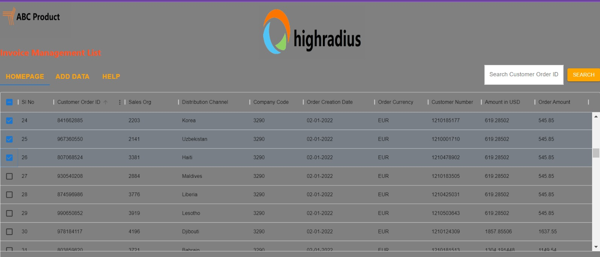

# AI B2B2 Invoice Management System

## Overview
The AI B2B2 Invoice Management System is a comprehensive web application designed to streamline the handling of invoice data. Built with a robust backend using Java servlets and MySQL, and a user-friendly frontend with React and Material-UI, the system allows users to efficiently manage, search, add, and delete invoice records.

## Features
- **Invoice Display**: View invoices in a dynamic, searchable grid.
- **Search Functionality**: Quickly find invoices using Customer Order ID.
- **Add Invoice**: Easily add new invoices to the system.
- **Delete Invoice**: Remove selected invoices from the system.
- **Analytics View**: Analyze invoice data with visual representations.

## Technologies Used
- **Backend**: Java, Servlet API, MySQL
- **Frontend**: React, Material-UI
- **Data Exchange**: JSON
- **Styling**: CSS

## Project Structure
src/

├── main/

│ ├── java/

│ │ └── com/

│ │ └── highradius/

│ │ ├── connection/

│ │ │ └── DatabaseConnection.java

│ │ ├── implementation/

│ │ │ ├── InvoiceDao.java

│ │ │ └── InvoiceDaoImpl.java

│ │ ├── model/

│ │ │ └── Invoice.java

│ │ └── servlet/

│ │ ├── DataLoadingServlet.java

│ │ └── AddServlet.java

│ ├── resources/

│ └── webapp/

│ └── WEB-INF/

│ └── web.xml

└── main/

├── react/

│ ├── public/

│ └── src/

│ ├── App.css

│ ├── App.js

│ └── GridComponent.js

└── package.json

## Backend Summary
### Database Connection
Handles MySQL database connection.

### Invoice Model
Defines the invoice data structure.

### Invoice DAO Implementation
Implements data access operations for invoices.

### Data Loading Servlet
Fetches and returns invoice data as JSON.

## Frontend Summary
### Grid Component
Displays invoice data in a dynamic grid with functionalities to search, add, and delete invoices.

## Screenshots
### 1. Front Image

### 2. Front Image - Selection of SL No.

### 3. Front Image - Add Data

### 4. Front Image - Fill Data

### 5. Front Image - Show New Data

### 6. Search Image

### 7. Help Image

### 8. Servlet Picture

## Getting Started

Java 8 or above
MySQL
React.js
npm

## Backend Setup
Clone the repository.
Set up the MySQL database using the provided schema.
Update database credentials in DatabaseConnection.java.
Build and deploy the Java application on a servlet container like Tomcat.

## Frontend Setup
Navigate to the react directory.
Install dependencies using npm install.
Start the development server using npm start.

## License
This project is licensed under the High Radius 
